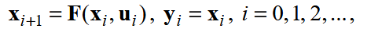
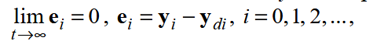
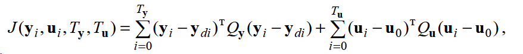
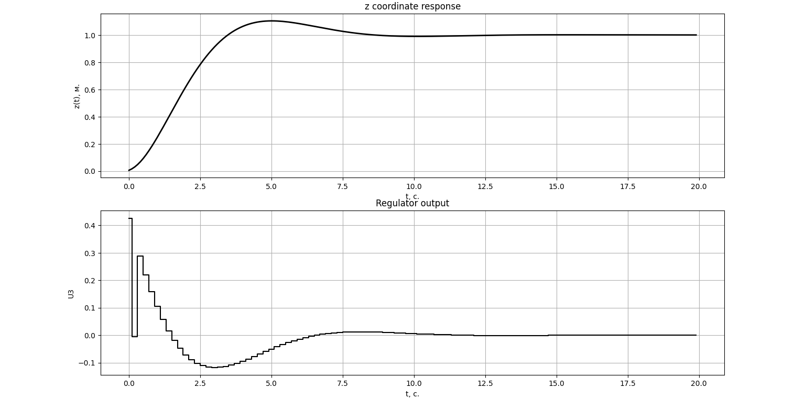
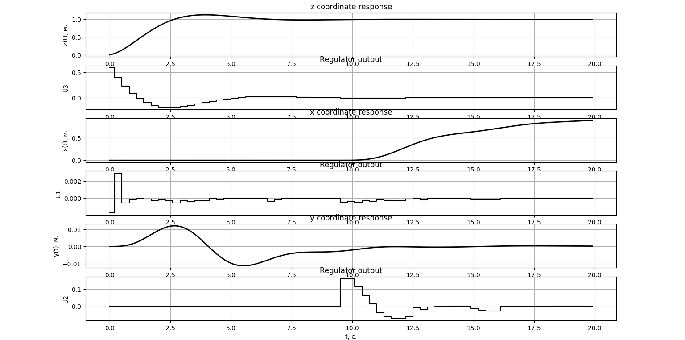
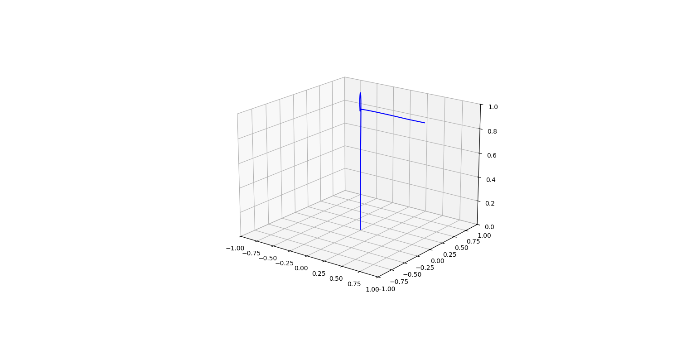

**Controller based on MPC method and its apptication for quadcopter dynamic model control**  
These materials have been used to obtain results published in [this paper](https://doi.org/10.26160/2541-8637-2025-15-7-16).  

**Quick overview of the files included:**  
`optima.py` contains function of controller implementation. The controller does:
1. model behavior prognosis  

2. error calcutation  

3. otimal criterion calcutation  

4. minimization of this criterion.  

_Mind that it uses `minimize` function from `scipy.optimize`._  
This function also contains in itself initial input signal guess as well as bound conditions for signal set to (-10,10). Both of this can be changed if needed.

`dynamics.py` conteins dynamic model funtion (see Quadcopter-model [repository](https://github.com/Tindalus/Quadcopter-model)). In this case it outputs total angular velocity as well.  
`Model.py` central script simulating model's controlled behavior and containg controller parameters and desired projectory setup.  
`plot.py` used to plot the results.  

## Setup
**`optima` from `optima.py` takes 7 arguments:**  
> Xdesired (listlike): listlike of the cut of desired trajectory. Dimentions (int(PredHorizon/PredStep)*n,1)
> 
> Udesired (listlike): listlike of desired input signal for the whole trajectory + some more (due to the funtion trying to predict beyond simulation time) times * input dimention, so for example ((N+100)*m,1)
>   
> Xinitial (listlike): listlike of the initial state variables. (n,1), where n is the number of state dimentions
> 
> PredHorizon (float): time of prognosis in seconds
> 
> PredStep (float): numerical grid step for prediction model
> 
> Weights1 (listlike): weights for the first term of optimal criterion
> 
> Weights2 (listlike): weights for the second term of optimal criterion  
   
It returns dictionary: U['x'] contains the sequence of inputs for the whole prediction period. See more in the documentation for minimize function from scipy.optimize [here](https://docs.scipy.org/doc/scipy/reference/generated/scipy.optimize.minimize.html).  

At ht end of `Model.py` there is a `np.save` function fro state and inputs records. It than loaded in `plot.py` for plotting the results. It's made because the calculation can take several minutes on larger simulation lengths or bigger prediction horizons. Make sure to specify the correct path for this function.
## Examples
The simple lift on 1m above ground can be simulated by following trajectory setup:
```
DesiredTrajectory = np.zeros(shape=((N+100)*n,1))
VariableIndex=0
for j in range(0,N+100):
    DesiredTrajectory[j*n+VariableIndex] = 1
```
_Adding 100 to trajectory lenght is needed since controller generates prediction beyond simulation lenght._
The output of this movement:

`Model.py` contains an example of movement from intital position to 1m along z coordinate, than 1m along x and finally 1m along y coordinate.  
This is simulated movement:  
  

